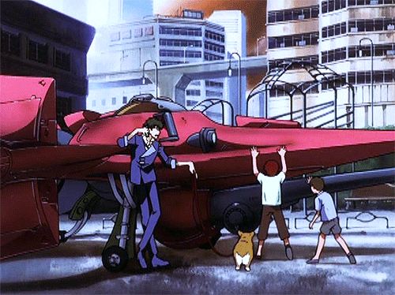

<!--  -->

# About Me

👋 Hello there, my name is Jason. I'm currently taking a CS degree in Bandung Institute of Technology. \
📚 **Currently learning:** Backend development. \
🔥 **Interested in:** Fullstack development.

 \

